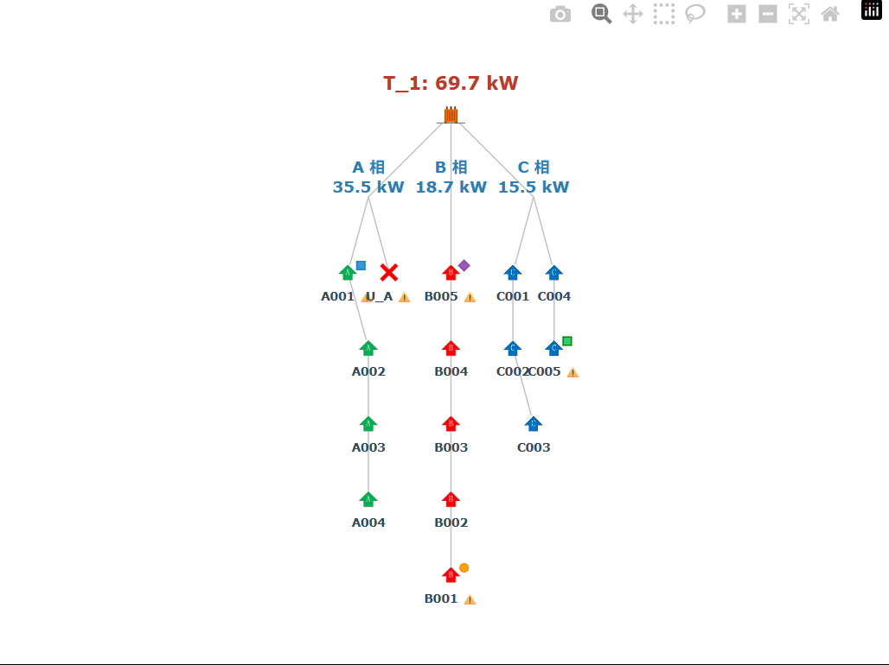
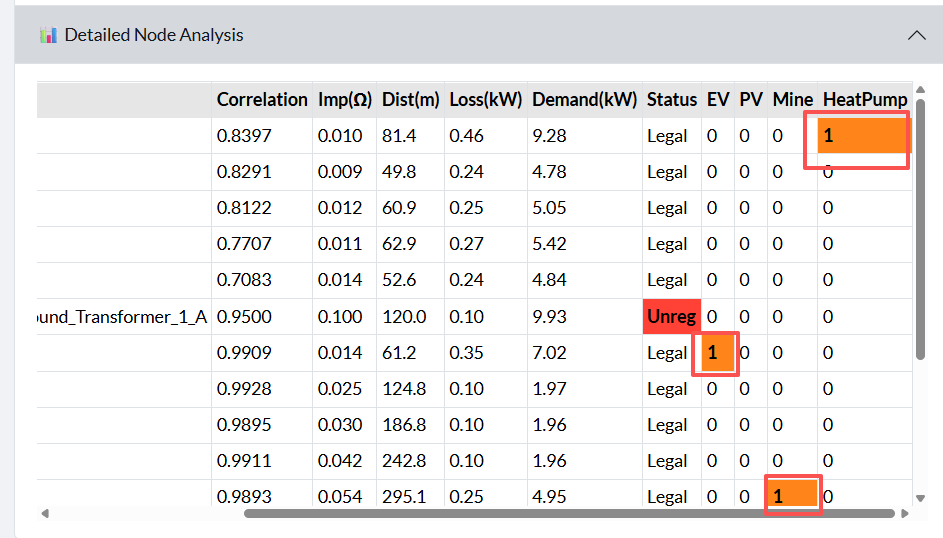
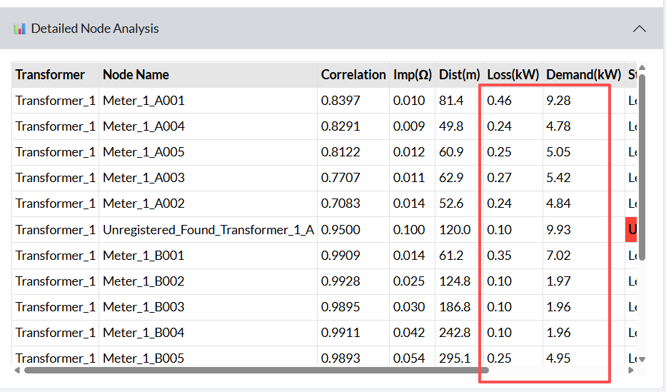
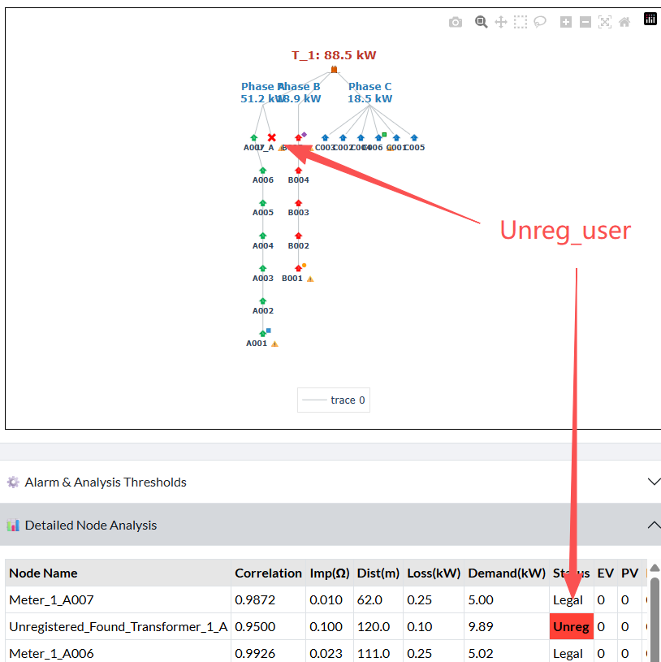

# HarmoniSense-LV Physical AI Diagnostic System: Core Functions and Principles White Paper

## Abstract

With the rapid proliferation of distributed energy, electric vehicles, and non-linear loads, low-voltage (LV) distribution grids face numerous management challenges. Traditional substation area management models, which rely on manual surveys and schematic registrations, are increasingly inadequate for addressing issues like frequent changes in line-user relationships and hidden illegal connections. This paper introduces the **HarmoniSense-LV Physical AI Diagnostic System**, which proposes a solution deeply integrating graph theory algorithms with electrical physical laws (such as Kirchhoff's laws and Ohm's law). By extracting the microscopic power quality time-series correlation and high-frequency harmonic fingerprints embedded in smart meters, this system enables rapid construction of substation area physical topology, localization of specific high-power equipment, and detection and localization of illegal electricity theft nodes. This white paper aims to elucidate the core diagnostic principles and business application value of this system.

## Introduction

In the wave of modern new power system construction, the transparency of the "last mile of the distribution network" has become a recognized challenge for digital transformation within the industry. Substation area managers have long been plagued by three major pain points: first, **"unclear records"**, where the correspondence between the physical cable routes from transformers and actual electricity users is often a mess; second, **"hidden dangers"**, where illegal connections by "black users" (unregistered users) and high-frequency impulse loads (such as high-power charging piles, PV inverters) act like ticking time bombs, easily leading to transformer overload burnout or severe three-phase imbalance; third, **"blind upgrades"**, where the expansion and grid renovation of substation areas often lack scientific basis due to the absence of real physical line loss and end-of-line voltage distance data.

The traditional approach to breaking this deadlock often involves a "heavy asset model" – deploying a large number of physical monitoring terminals in various branch boxes within the substation area. **HarmoniSense-LV**, however, pioneers a new "light asset" data decoupling path. We treat the entire distribution network as a vast electromagnetic signal transmission network, transforming harmonic distortions and voltage micro-waves, originally considered "interference noise," into excellent "electrical sonar" for tracking the physical locations of equipment. This system pays homage to classic grid physical models, truly grounding artificial intelligence in rigorous Ohm's law and energy conservation principles, converting the invisible "electromagnetic signals" in the distribution network into a clear and visible "substation area panoramic topology map" and precise "user profiles."

---

## 1. Substation Area Physical Topology Reconstruction

**🎯 Business Pain Point**  
For a long time, low-voltage distribution grids have faced issues of unclear records and chaotic line-user relationships. Which branches are fed by the transformer? Which main line is a meter connected to? This information traditionally requires significant manual effort for on-site surveys.

**📊 Judgment Basis**  
**Time-series correlation of power quality waveforms (waveform correlation)**

**💡 Core Principle: Signal Homogeneity and Line Propagation**  
On the same physical cable, upstream voltage fluctuations (e.g., a slight voltage drop caused by a large load starting) will inevitably propagate along the line to all downstream meters.
Our AI engine extracts the waveform fluctuation trajectories of all smart meters and performs a global, multi-dimensional comparison: **meters with highly consistent fluctuation trajectories are physically closer on the line.**
Based on a "trunk feeder" physical model, the system intelligently filters out chaotic random noise interference, accurately restoring chaotic grid data into a clear tree-like topology: "Transformer ➔ Phase Busbars ➔ Multiple Trunk Branches ➔ Various Levels of Meters."

  
<b>📸 Figure 1: AI-Reconstructed Panoramic View of Substation Area Three-Phase Physical Topology</b>

  

---

## 2. Hidden High-Power Device Identification

**🎯 Business Pain Point**  
With the popularization of new energy vehicles and rooftop photovoltaics, a large number of non-linear devices are entering the distribution network, easily causing three-phase imbalance and transformer overload. How can these hidden "grid killers" be precisely identified without "opening boxes or entering homes"?

**📊 Judgment Basis**  
**High-frequency characteristic harmonic distribution of devices (electrical fingerprint)**

**💡 Core Principle: Electrical Fingerprint Decoupling**  
Different electrical devices, when operating, inject distinct "electromagnetic noise" into the grid:
- **New Energy Charging Piles (EV)**: High-power AC/DC conversion generates extremely high-frequency pulse distortions.
- **Photovoltaic Inverters (PV)**: Grid connection transients and PWM modulation create specific frequency band noise.
- **Large Computing/Mining Machines (MINE)**: 24-hour full-load operation of high-frequency switching power supply arrays produces highly characteristic low-to-mid frequency energy clusters.
- **Large Heat Pumps/Heavy Air Conditioners (Heat Pump)**: The start-stop of variable frequency compressors brings intermittent distortions.

Our AI system acts like an experienced sonar operator, capable of precisely stripping away and identifying these unique "harmonic fingerprints" from complex grid waveforms, thereby accurately pinpointing the hidden locations of various devices.

  
<b>📸 Figure 2: Precise Capture of High-Power Anomalous Devices</b>

  

---

## 3. Physical Distance and Line Loss Estimation

**🎯 Business Pain Point**  
Which meters are at the very end of the power supply? Which section of the line has the most severe physical line loss? The lack of intuitive distance data makes substation area renovation and upgrades (e.g., capacity increase, line replacement) difficult to initiate.

**📊 Judgment Basis**  
**Physical hierarchy of the topology tree and impedance accumulation model**

**💡 Core Principle: Ohm's Law and Voltage Drop**  
Electrical energy transmission along cables is inevitably accompanied by ohmic losses. After clarifying the main branch topology of the substation area, the AI "follows the vine" starting from the transformer. The system automatically deduces the relative physical distance and accumulated impedance for each user based on the node's relative depth (level) in the tree topology and waveform attenuation rate, thereby visually exposing disadvantaged "end-of-line low-voltage users."

  
<b>📸 Figure 3: Physical Line Loss and End-of-Supply Inference</b>

  

---

## 4. Electricity Theft and Unregistered User Detection

**🎯 Business Pain Point**  
Illegal connections by "black users" (unregistered users) or unauthorized electricity theft, not being registered in the system's marketing archives, not only cause significant economic losses to power supply companies but also pose extremely serious fire safety hazards.

**📊 Judgment Basis**  
**"Energy residual" between total transformer power and the sum of legal meter readings**

**💡 Core Principle: Kirchhoff's Law of Energy Conservation**  
Within a closed substation area, the total energy output by the transformer must equal the sum of energy consumed by all known legal meters (plus normal line losses).
The AI system performs extremely rigorous energy reconciliation: once a large "undercurrent" is detected at the transformer end that cannot be explained by existing registered meters, it is immediately determined that an illegal connection (unregistered user) exists.
Even more powerfully, the system can not only detect this undercurrent but also **extract its fluctuation characteristics**. Through network-wide feature comparison, it precisely locates this as a "virtual unregistered user node" and directly attaches it to the actual physical line from which it is stealing electricity, leaving no place for electricity thieves to hide!

  
<b>📸 Figure 4: Unregistered User Identification</b>

  

## 📚 Theoretical Foundation and Acknowledgements

The algorithmic design philosophy and physical mapping logic of this platform are deeply inspired by the following academic achievements:

- **Paper Title**: *Utilising Smart-Meter Harmonic Data for Low-Voltage Network Topology Identification*
- **Core Team**: Ali Othman, Neville R. Watson, Andrew Lapthorn (University of Canterbury); Radnya Mukhedkar (EPECentre).
- **Journal**: *Energies* 2025, 18(13), 3333.
- **Paper Link**: [https://doi.org/10.3390/en18133333](https://doi.org/10.3390/en18133333)

**Acknowledgements**: Special thanks to the research team at the University of Canterbury for their pioneering work in the field of low-voltage distribution network harmonic analysis.
