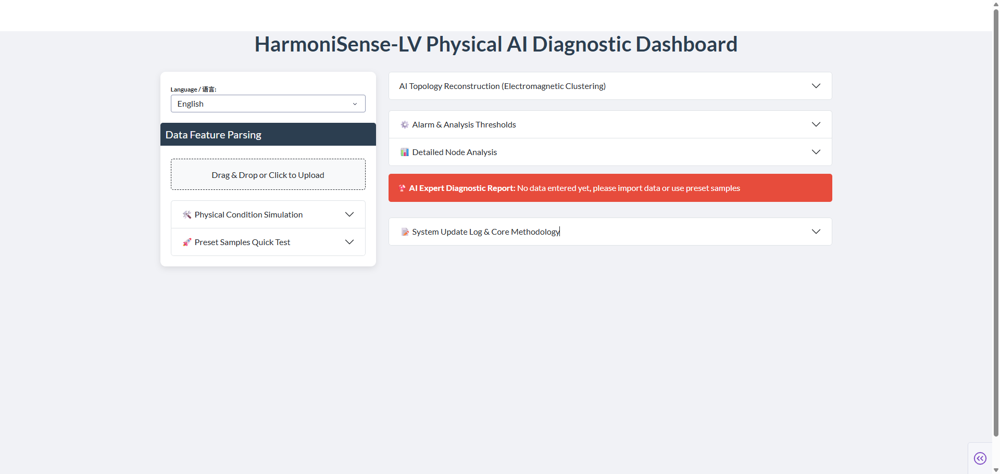
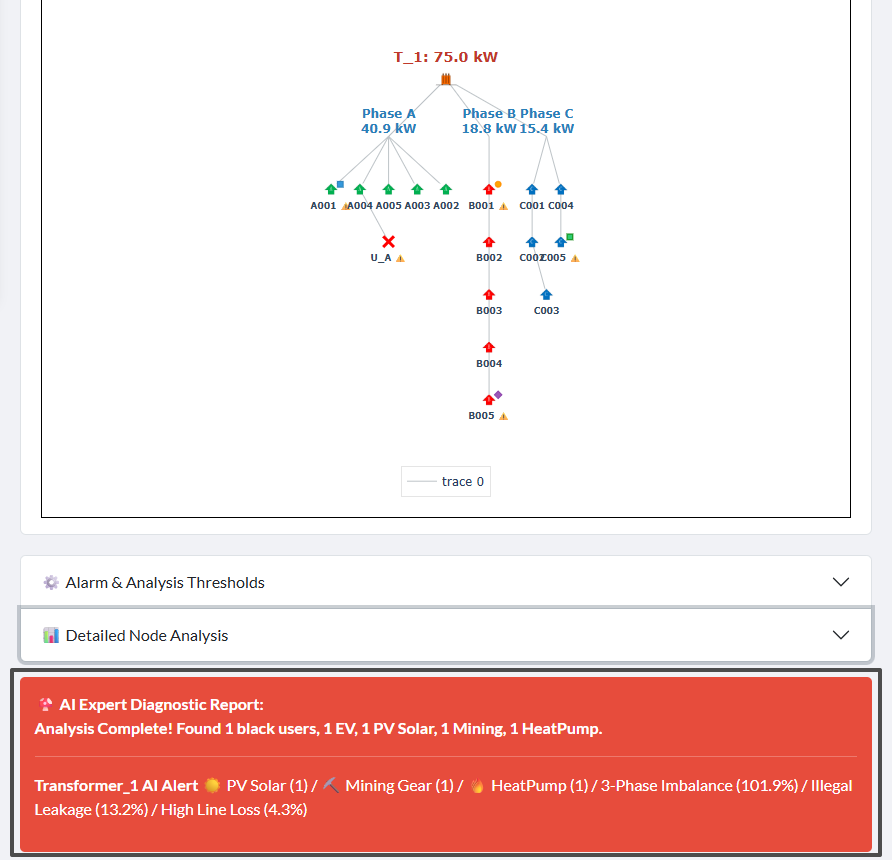
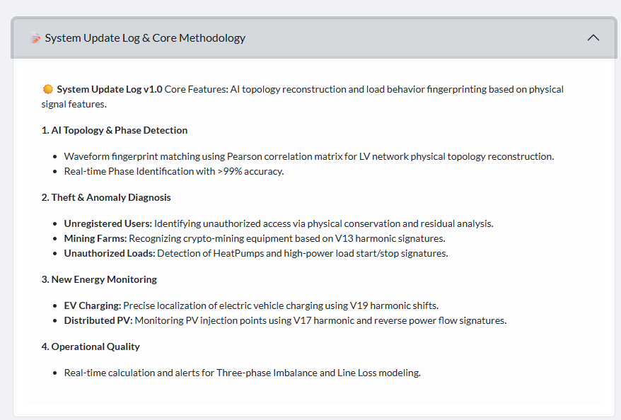

# Product Specification: HarmoniSense-LV Low-Voltage Distribution Network Physical Fingerprint AI Diagnostic Platform

## 1. Product Overview
**HarmoniSense-LV** is an industrial-grade diagnostic platform designed for smart grid operation and maintenance. It achieves "transparent" substation area management without additional hardware investment by deeply analyzing physical waveform characteristic signals in low-voltage distribution networks. The platform integrates core AI algorithms such as automatic topology reconstruction, electricity consumption fingerprint identification, and illegal node detection, effectively addressing the four major pain points of low-voltage distribution networks: "unclear topology, inaccurate phasing, hidden electricity theft, and unauthorized connections."

  
  
<b>Figure 1: HarmoniSense-LV System Global Central Dashboard Interface</b>

---

## 2. Core Function Modules

### 2.1 AI Topology Precise Reconstruction
- **Phase Identification**: Utilizes the Pearson correlation coefficient matrix algorithm to automatically match meter and transformer baseline waveforms, addressing the issue of severely outdated traditional substation area phase records.
- **Physical Topology Restoration**: Based on the Minimum Spanning Tree (MST) optimization algorithm, it automatically generates a tree-like topology diagram from the transformer to various branches and end-users.
- **Visual Interaction**: Provides a dynamic electromagnetic clustering topology view, supporting real-time hover preview of node status.

  
  
<b>Figure 2: AI Topology Reconstruction Results and Electromagnetic Clustering Analysis View</b>

### 2.2 Multi-Dimensional Load Fingerprint Diagnosis
The system can automatically identify and locate the following specific electricity consumption behaviors through its AI expert module:
- **EV Charging**: Captures the 19th specific harmonic offset characteristic when electric vehicles are connected.
- **Distributed Energy (PV)**: Monitors the 17th harmonic and power flow characteristics generated by photovoltaic inverters.
- **Illegal Mining**: Precisely locates cryptocurrency mining farms through constant high-power spectrum characteristics of V13-V15 harmonics.
- **Environmental Temperature Control (HeatPump)**: Identifies start-stop signals of high-inductive loads such as heat pumps and large air conditioners.

  
  
<b>Figure 3: High-Precision Load Fingerprint Diagnosis and Expert Analysis Pop-up</b>

### 2.3 Abnormal Electricity Consumption and Theft Analysis
- **Unregistered User/Leakage Detection**: Based on the principle of "physical total energy conservation in the substation area," it quickly identifies unauthorized users (Black User) by calculating bus residual fingerprints.
- **Theft Localization**: Estimates the distance of abnormal connection points through impedance evolution logic, assisting in precise offline investigation.

### 2.4 Operational Quality Assessment
- **Three-Phase Imbalance**: Real-time monitoring of A/B/C three-phase load distribution, providing imbalance warnings.
- **Physical Line Loss Model**: Calculates theoretical line loss based on physical characteristics, and identifies potential abnormal power consumption by comparing it with actual errors.

---

## 3. Core Technical Advantages
1. **Application Method Based on Power Quality Data**: Designed for smart meters with high-order harmonic monitoring capabilities, achieving deep perception of grid conditions through application-layer algorithms.
2. **Efficient Identification Capability**: The system possesses reliable phase identification capabilities and the ability to detect and analyze characteristic loads (such as EV, PV, illegal loads, etc.).
3. **Physical AI Engine**: Unlike purely statistical models, this method deeply integrates the electromagnetic physical characteristics of the distribution network, and the analysis results have a clear physical background.

---

## 4. Quick Operation Guide
1. **Data Import**: Upload substation area operational feature data in Excel/CSV format via the left panel.
2. **Threshold Setting**: Configure alarm thresholds for imbalance, overload utilization, etc., in the "Alarm & Analysis Thresholds" panel.
3. **Start Analysis**:
   - Click **🚀 Load Preset Sample**: Directly view the operational report of a standard substation area.
   - Click **🚀 Start AI Diagnosis**: Execute automated diagnosis on the imported data.
4. **Analysis Results**:
   - **🤖 AI Expert Diagnostic Report**: View the system-generated summary and recommended actions.
   - **📊 Detailed Node Analysis**: View specific impedance, distance, and load details for each user in the data table.

---

## 5. **Methodology Reference**
The platform includes **v1.0 Update Log & Model Description** (accordion button at the bottom of the webpage), which details the identification logic for harmonic fingerprints from V13 to V19 and the mathematical principles of Pearson spatial mapping.

  
  
<b>Figure 4: Data Import, Preset Sample Testing, and Expert Analysis Report</b>

---

## 6. Theoretical Foundation and Acknowledgements
The core algorithmic logic of this system deeply references and acknowledges the following international cutting-edge research achievements:

- **Paper Title**: *Utilising Smart-Meter Harmonic Data for Low-Voltage Network Topology Identification*
- **Main Authors**: Ali Othman, Neville R. Watson, Andrew Lapthorn, Radnya Mukhedkar.
- **Research Institution**: University of Canterbury, New Zealand
- **Publication Information**: *Energies 2025*, 18(13), 3333.
- **DOI**: 10.3390/en18133333

**Disclaimer**: This system aims to industrialize the aforementioned advanced theories, achieving digital upgrades in substation area perception for distribution networks.

---

> **© Designed and Optimized by Clark**
> *I have obtained the key to Babel, and I shall raise countless towers in Shinar.*
